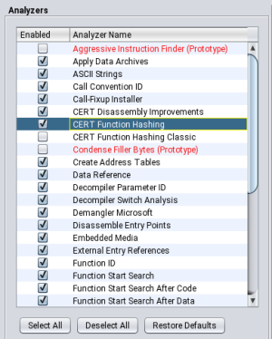
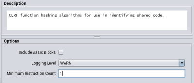
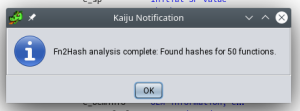
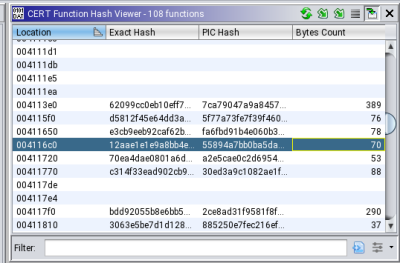
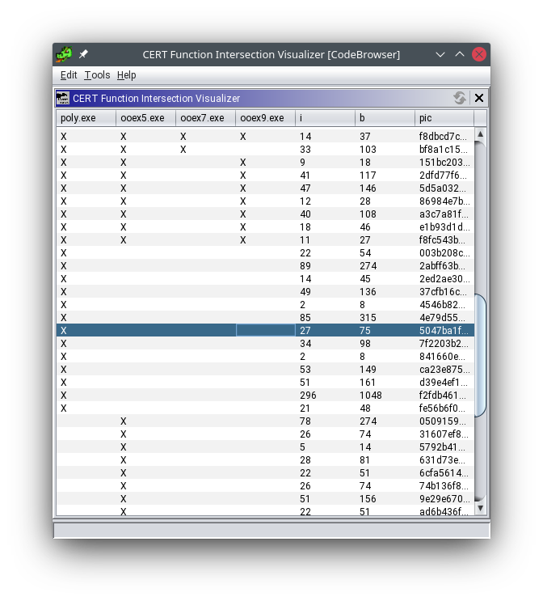

# Function Hashing and Similarity Comparison

CERT Function Hashing is a collection of tools that allow for creation of static hashes
that may be used to identify functions within a program or test similarity between programs.
These hashes may be used in malware analysis and identification, including identifying
important features of a program to include in YARA signatures.
    
The Function Hashing feature consists of:
    
- A Function Hashing Analyzer
- An Exporter that exports hashing data to both YARA format and a custom hash format
- A GUI Plugin for interactive analysis of the function hashing data of a single program
- A GUI Plugin for visualizing the intersection of function hashing data between multiple programs

    
## Running the Analyzer

    
The CERT Kaiju Function Hashing analyzer may be run as part of Ghidra's Auto-Analysis step, or on its own as a
one-shot analyzer via the menu in the Ghidra CodeBrowser. Before running the Auto-Analysis, a couple of
options may be configured as shown below.

    
- "Include Basic Blocks". Check this to include basic blocks in the hashing algorithm.
- "Logging Level". Select the level of logs and notifications to use. The default is "WARN",
    but it may be lowered to "ERROR" to report only the most serious notifications indicating some
    kind of error or bug, or raised to "INFO" to include lots of information and
    notifications about how the analysis works.
- "Minimum Instruction Count." This option tells the analyzer how many instructions to look
    for before hashing a function. Setting a higher value might avoid small functions and thunks
    that do not help identify more complex malware. The current implementation does not
    fully respect this number so be aware you still may get some small functions in the hashing
    results.
    
After running the analyzer, you may receive a pop-up notification alerting you that the
analysis is complete, and giving a count of how many functions were hashed.
(This notification is controlled by the "Logging Level" option as shown above.)

    
    
## Using The GUI Viewer Plugin
    
You can access the graphical interface (GUI) hash viewer via the Ghidra CodeBrowser menu
`Window > CERT Kaiju Function Hash Viewer`. Initially, the window will look blank like
the following.

If preferred, instead of a modal window, you can click and hold, then drag and drop the
window into your preferred location in the CodeBrowser to have it permanently visible.
This might be useful if you intend to regularly use the Function Hashing capability.

Once analyzer data is available, the viewer will look like the following:

    
The columns can be customized to display different types of hashes by right-clicking
on the table's title bar and selecting the "Add/Remove Columns" option from the pop-up
menu. The CERT Kaiju Function Hashing analyzer currently creates the following types of hashes:
    
- "Exact Hash". The MD5 hash of the exact bytes that make up the function.
- "PIC Hash". The MD5 of the "position-independent" bytes. This algorithm attempts to
    identify which bytes represent addresses, and replace addresses with "00" bytes to
    create a position-independent hash that is equivalent across implementations.
- "Mnemonic Hash". The MD5 of the string representing the instruction mnemonics
    and counts of how many of those instructions occur in the function bytes.
    This is an experimental hash, and not visible by default.
- "Mnemonic Category Hash". The MD5 of the string that represents the categories
    of instruction mnemonics appearing in the function bytes. The categories include
    arithmetic instructions, memory instructions (store, load, etc.), and more.
    This is an experimental hash, and not visible by default.
    
    
## Exporting Hashing Data
    
The hashing data may be saved to an external file for use with other tools.
Currently, we support two different types of exports:
    
- "Export to CSV", which exports the hashing data to a comma-separated values (CSV)
    list.
- "Export to YARA", which exports only the hashing data relevant to identifying
    the function to the YARA format that may then be imported into other malware analysis
    and defense tools.
    
If one or more rows in the viewer table are selected by the user, the export buttons
will export _only_ the selected rows. This allows an analyst to generate YARA
signatures for only the chosen interesting functions, for example. If no rows are selected,
the buttons will then export hashing data for all functions in the table.
    
## Using The Function Hash Intersection Visualization Plugin
    
You can access the graphical interface (GUI) intersection visualization via the Ghidra
CodeBrowser menu `Window > CERT Kaiju Function Intersection Visualizer`.

As with the Hash Viewer plugin, this window may be docked with Ghidra if you expect
to use it regularly.
